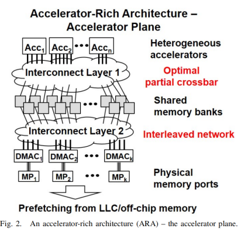
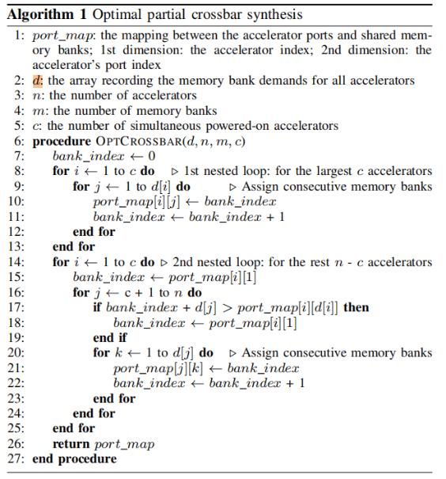
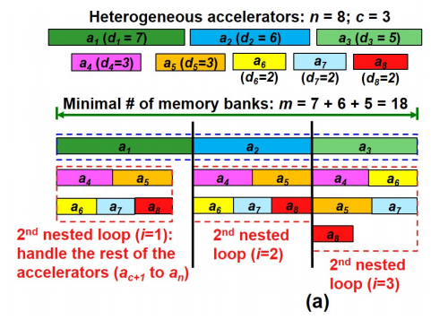
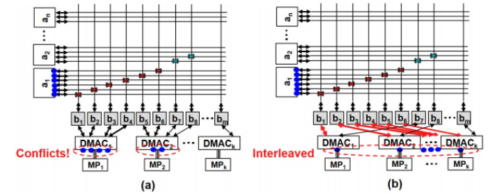
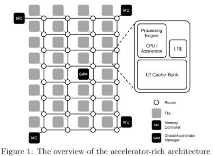
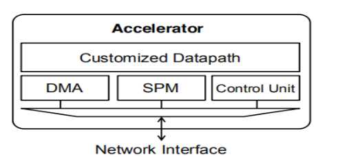
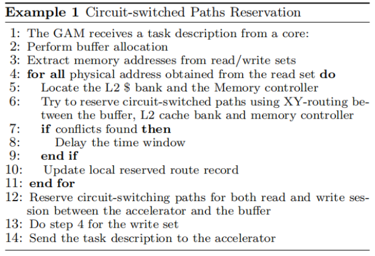
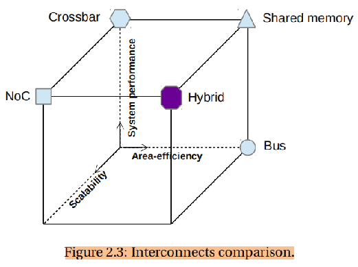
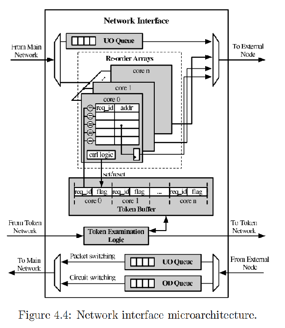
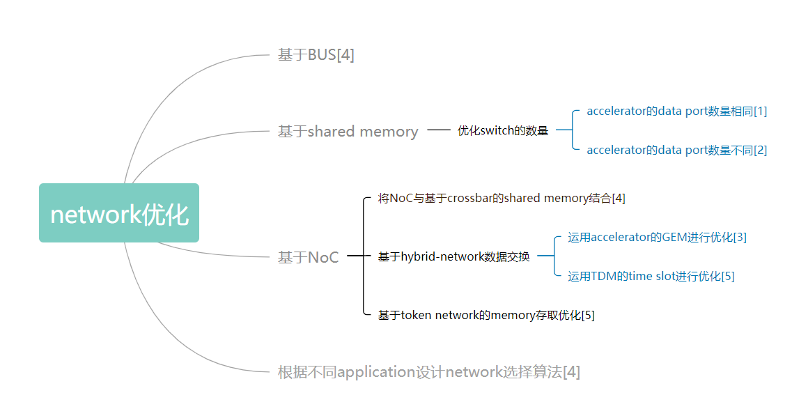

# 1 Optimization of Interconnects Between Accelerators and Shared Memories in Dark Silicon

## 1 研究目的

​    加速器（accelerator）之间的数据传输需要高速传输，而共享内存（Shared Memories）是一种减小数据传输时间的方式，本文主要研究如何设计Shared Memories与accelerator之间的连接，使得既能够提高数据传输速率，又可以节约硬件资源。   

​    本文主要根据三个方面进行连接的优化：   

#### 1.1 相同加速器的多个数据端口一起通电/断开

​    由于同一个accelerator的多个数据端口（data port) 基本同时通电或者断开，这样一个accelerator和一个memory bank之间只需要一个switch进行连接，节省了switch的数量。   

#### 1.2 暗硅时代芯片可以同时支持的加速器的有限的

​    如题，芯片可以同时power的加速器个数是有限的，本文提供了三个设计使得switch的数量逐渐减少：

##### 1.2.1 100%路由性能下的最小设计

   这种设计是满足memory bank的数量恰好等于最大能够power的accelerator的个数c与每个accelerator的data port数量（这里假设都为n）之积（n*c)。

##### 1.2.2 100%路由性能下且并非最小memory bank数量的设计

   这种设计是满足memory bank的数量大于最大能够power的accelerator的个数c与每个accelerator的data port数量（这里假设都为n）之积（n*c)，这个时候可以减小switch的数量，实现硬件优化。

##### 1.2.3 95%路由性能下的设计

  路由性能指的是各种c个accelerator的组合可以实现的概率，而实际上有些路由组合是用不到的，所以可以通过去掉这些组合，达到95%的路由性能，从而减小switch的数量。

#### 1.3 加速器的异构性

  accelerator之间的相关性在图（a）中显示，相关性越高，越有可能同时被power，所以在设计的时候，可以将这些accelerator的data port与memory bank的连接进行分散化分配，如图（b）所示。而这是借助accelerator的异构性减小了switch的数量。

## 2 有价值的idea

  本文主要是讲述如何减小switch的数量，可以在确定使用shared memory优化accelerator数据传输后，用来减小switch的数量。

## References

[1] J. Cong and B. Xiao, "Optimization of interconnects between accelerators and shared memories in dark silicon," 2013 IEEE/ACM International Conference on Computer-Aided Design (ICCAD), San Jose, CA, 2013, pp. 630-637.

# 2 Interconnect Synthesis of Heterogeneous Accelerators in a Shared Memory Architecture

## 1 研究目的

  本文主要是从accelerator与shared memory和外存储器的链接两个方面提供了相应的网络设计算法与架构，实现数据的快速传输。如下图所示：

#### 1.1 Optimal partial crossbar

  这是在accelerator与shared memory之间的连接。提出了memory bank对应accelerator的各个data port的分配算法，与上一篇文章不同的是，这里的每个accelerator的data port数量并不一定相等。算法的伪代码如下图：

以图（a)为例说明代码含义：

假设异构accelerator共有8个，最多能够power的数量为3个，首先对于accelerator按照data port数量d进行从大到小排序，然后将最多容纳的3个accumulator和memory bank进行一对一分配，如图中a1，a2，a3，并分成了3个region。然后将剩下的5个accelerator进行一对3分配，即在每个region内重新一轮分配。

根据这种算法，最终得到的switch的数量为：

#### 1.2  Interleaved network

第二部分是Interleaved network，用于memory bank与外存储器之间的连接，用来缓解在DMAC的conflicts，实现数据的快速传输：

## 2 有价值的idea

提出了怎样去连接accelerator和memory bank、外存储器，实现数据的有效传输,减小了switch的数量，可以在确定使用shared memory优化数据传输时提供具体的分配算法。

## References

[1]Y. Chen and J. Cong, "Interconnect synthesis of heterogeneous accelerators in a shared memory architecture," 2015 IEEE/ACM International Symposium on Low Power Electronics and Design (ISLPED), Rome, 2015, pp. 359-364.

# 3 On-chip Interconnection Network for Accelerator-Rich Architectures

## 1 研究目的

与通用型processor相比，加速器可以提高几个数量级的性能，但是加速器的吞吐量常常受到加速器与内存系统数据传输速率的限制，这就增加了对芯片上网络(NoC)设计的需求。

在这篇论文中，提出了混合网络预测预留的架构：

（1）提出了基于位置和精确时间周期的加速电路交换路径的全局管理方法。

（2）提出了混合网络在预留时间内提供传输预测，从而减少包交换而造成的干扰。

本文主要是介绍the Hybrid network with Predictive Reservation (HPR)。

#### 1.1 Baseline architecture

##### 1.1.1 总体网络架构

本文的基本结构如下图所示：

主要由三部分组成：

1) on-chip accelerators   实现复杂的专门固定功能

2) buffer in NUCA   缓存

3) a global accelerator manager   协助进行动态负载平衡和任务调度

##### 1.1.2  加速器组成

其中，DMA负责在SPM和共享的L2缓存之间传输数据，在SPM之间传输数据， 

全球加速器管理器(GAM):

1)它提供了一个软件调用加速器的单一接口，

2)提供共享资源管理，包括缓冲区分配和多个加速器之间的动态负载平衡。

#### 1.2  Global Management of Circuit-Switching

   GAM能够在将任务分配给加速器之前，从核心发送的任务描述中获取有关加速器类型和读/写集的信息。因此，可以很容易地获得加速器的延迟，并且可以通过执行地址转换来提取可能的读/写位置。根据这些信息，GAM可以知道通信的时间，而不必实际执行任务。为了防止路径保留中的冲突，GAM使用一个全局保留表来跟踪网络中每个路由器的当前保留状态。由此，可以将各个任务进行排序，分配不同的路由，实现circuit-switching。   

主要算法如下图所示：

#### 1.3  Hybrid Network

Hybrid Network就是在network中不仅有circuit-switching还有packet-switching，如下图所示：

在一个保留的电路交换会话开始之前，路由器需要检查传入的flit的电路字段，以确定数据流是否到达。一旦确认了数据流，路由器就会将传入的flits直接转发到已经根据预约配置好的switch。在会话结束之前，缓冲区中的包交换flits不允许执行虚拟信道分配(VA)和开关分配(SA)。如果电路字段为零，则说明这是一个包交换flit，电路交换结束，开始包交换。  

## 2 有价值的idea

本文提出的网络主要是基于NoC的混合网络，运用accelerator中的GEM 对不同的任务进行时间预测，并运用混合网络实现circuit-switching和packet-switching，实现减少时间的作用。如果想要实现基于NoC的优化，可以使用这种方法。

## References

[1]J. Cong, M. Gill, Y. Hao, G. Reinman and Bo Yuan, "On-chip interconnection network for accelerator-rich architectures," 2015 52nd ACM/EDAC/IEEE Design Automation Conference (DAC), San Francisco, CA, 2015, pp. 1-6.   

# 4 Hybrid Interconnect Design For Heterogeneous Hardware Accelerators

## 1 研究目的

本文首先列举了基于Bus的网络架构的例子，然后是对于异构芯片提出了使得效率增加、数据传输时间减少的设计方法：

（1）A heuristic-based and detailed profile-driven interconnect design

（2）An automated hybrid interconnect design

#### 1.1 基于Bus的网络架构

accelerator与CPU不同的地方就是数据的throughput比较大，可以从以下四个方面对于数据传输速率进行优化：

1）Bus-based interconnect
2）NoC-based interconnect
3）Shared memory
4）Crossbar

它们产生的影响和优缺点如下图所示：

基于Bus的结构，如下图所示，

假设两个kernel之间的数据传输是必须经过host processor，这样会消耗大量的时间，因此将Bus与其他的结构结合可以改进：

1）与DMA混合：两个kernel的local memory之间的数据传输使用DMA进行存取，节省了从Host processor传输的时间；

2）与crossbar混合：两个kernel的local memory之间的数据传输使用crossbar进行存取；

3）与DMA和crossbar同时混合：两个kernel的local memory之间的数据传输使用crossbar进行存取，其他的kernel可以使用DMA进行数据传输；

4）与NoC混合。

#### 1.2 A heuristic-based and detailed profile-driven interconnect design

由于运行的application是不一样的，所以使用的interconnect也是不同的，根据不同的application产生的数据传输图以及数据流量可以提出一种自发性的基于detailed profile（就是数据传输图）的interconnect。

本文首先提出了四种不同的解决方案，然后设计了一种算法，根据不同application的QUAD toolset（就是detailed profile），选择不同的解决方案：

1）Solution 1 Crossbar-based shared local memory
2）Solution 2 DMA support for parallel processing
3）Solution 3 Local buffer                                                                                                                                                4）Solution 4 Hardware accelerator duplication

算法如下图：

这种算法主要是在embedded platform上面使用。

#### 1.3 An automated hybrid interconnect design

这种方法主要是基于shared memory和NoC，shared memory根据有没有crossbar可以分成两类，而NoC将kernel和local memory分别对应到网络中,在设计interconnect的时候会优先选择crossbar，因为NoC的硬件开销比较大，主要的算法如下图所示：

在将kernel和local memory映射到NoC的过程中不一定需要将所有的都映射上去，因为有些组合是不可以实现的，基于这个可以减少NoC中的硬件资源。 

## 2 有价值的idea

本文比较系统的介绍了减少kernel之间数据传输时间的方式，基于Bus,NoC以及根据不同application选择interconnect的算法，如果选用NoC可以参考本文。

## References

[1]Pham-Quoc, Cuong. (2015). Hybrid Interconnect Design for Heterogeneous Hardware Accelerators. 10.4233/uuid:862e5b58-b9d1-462a-90b0-6f94a054632e. 

# 5 Time-Division-Multiplexing Based Hybrid-Switched NoC for Heterogeneous Multicore Systems

## 1 研究目的

主要是两个方面，第一是基于NoC的circuit-switching和packet-switching混合网络传输数据，减少数据传输时间；第二是基于token network的减少时延提高内存存取数据效率，通过token的标志让memory数据存取排序有序，节省时间。

#### 1.1 **TDM-based Hybrid-Switched Network**

##### 1.1.1 网络结构

混合网络主要是硬件上将circuit-switching和packet-switching的结构同时存在，将时间分成不同的时间slot，在不同的时间进行不一样的数据传输，针对CPU一般会选择packet-switching，而GPU之类的accelerator选用hybrid -switching,如下图所示：

##### 1.1.2 网络的优化

由于circuit-switching建立连接之后省去路由的时间，所以根据以下两种情况对链路进行共享：

1）Hitchhiker-Sharing

当新建立的链路的目的节点与之前相同时，实现链路共享，其中链路数据传输的时间会存储在每个节点的Destination Lookup Table中。

2）Vicinity-Sharing

当新建立的链路的目的节点在原目的节点的附近时，也可以共享链路资源。

#### 1.2 **Memory Access Ordering Network**

这个网络是针对将memory连接在NoC上面的情况，和上一篇中local memory、kernel同时连接在network是一样的，但是为了减少内存访问时间，需要避免因为request被处理的排序导致的问题，这个时候就提出了这样一个内存存取排序网络，主要是由1.1中的混合网络、token ring network、network interface (NI) 构成。

##### 1.2.1 token ring network

token标志着request被处理的顺序的信息，会在token网络中传输。首先是token的形式，记载着每个core上面正在被处理的request的id，以及每个ordering节点的完成情况。当ordering节点完成操作之后，Mi就会被置为1。token会在token network中传输，当network interface需要的时候会取出来使用。

##### 1.2.2 network interface

network interface（NI）在每个ordering point接收并检查token，确保每个ordering 节点处理的request必须是比token中标志的request的id要小。

1）发送过程：当预留的time slot准备好的时候，有序的request会被注入网络中，当网络空闲的时候，无序的request会被传输。

2）接收过程：当无序的request被接收的时候，会按照FIFO的顺序进行排列；有序的request会在每个core的re-order array中排列，当token buffer中的对应的core的req_id的flag为1的时候，request会被按照顺序处理。

3）token的处理过程：当buffer中的flag被置为1的时候，就会开始处理对应的request。

## 2 有价值的idea

主要是两个方面，第一是基于NoC的circuit-switching和packet-switching混合网络传输数据，第二是基于token network的减少时延提高内存存取数据效率。如果是基于NoC的网络互连可以用本文方法设计互联网络和内存存取网络。

## References

 [1]Yin, J. . (2015). Time-division-multiplexing based hybrid-switched noc for heterogeneous multicore systems. *Dissertations & Theses - Gradworks*.

# 优化图

